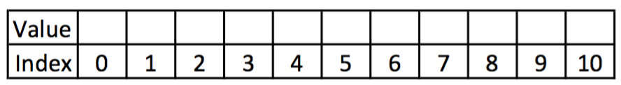
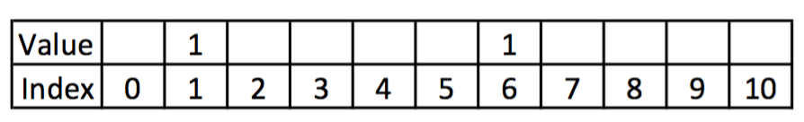
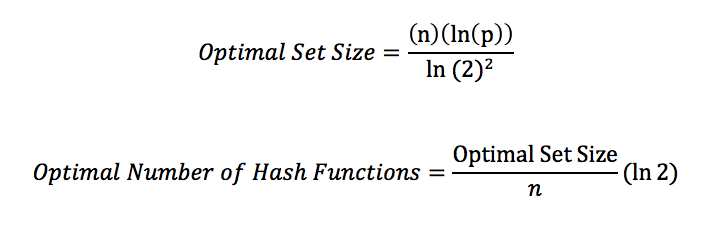

# bloomfilter

## [Lecture Video](https://vimeo.com/148858962)

## What is a bloom filter?
* Space-efficient probabilistic data structure.
* Super-fast.
* Used to tell you whether an object exist in a set.
* Uses several hash functions.

## Caveats
* Can tell you that an object is 'definitely' not in a set.
* Can tell you that an object is 'probably' in a set.
* Can't tell you that an object is 'definitely' in a set
* An object cannot be deleted from a set.

## A Closer Look
To add an object to the set, we need to hash it several times, each with a different hash function, and then store the value of 1 at the indexes returned by the hash functions.



For example, if I add the string "Nati", you can see the indexes given by the hash functions have a value of 1.



To find out whether the string exist in the set, we must hash the string with the same hash functions.  If the value 1 does not exist in the same indexes, then the string does not exist in the set.  Otherwise, the string 'probably' exist in the set because another string may have the value 1 in the same indexes.

## Is it better to use many hash functions?
If we use too many different hash functions, the amount of collisions will increase.  To determine the optimal set size and the amount of hash functions to implement, follow the formula below:



'n' is the number of objects planning to store in the set.
'p' is the acceptable probability of a collision or false positive.

## Exercises
### 1. Implement a BloomFilterTable class in pseudo-classical style.

### 2. Make the following properties appear on all instances.
* An ```.insert()``` method, which takes any string and stores the numeric value of '1' at the index, given by the hash function(s).
* A ```.contain()``` method, which takes any string and returns a boolean reflecting whether it can be found in the set.
